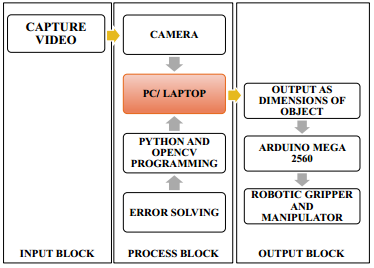
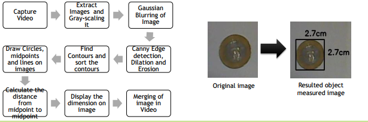
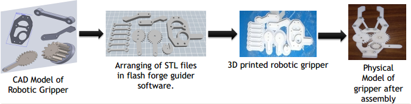
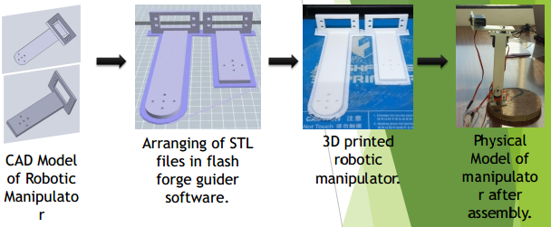
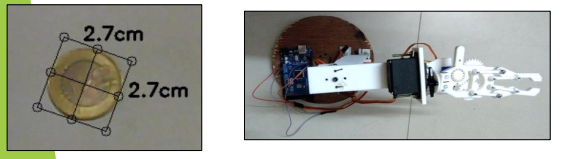

# DEVELOPMENT OF VISION BASED PICK AND PLACE WITH ROBOTIC ARM

### STUDENTS NAME: 
### SIDDHESH GHADI, KRISHNA GUPTA, KESHAV GHUSSAR, PRAMOD HATTURE

## Guided By Nitin Nandeshwar
### 20 May 2016

## Abstract

Image processing in today’s world grabs massive attentions as it
leads to possibilities of broaden application in many fields of high technology. This project demonstrates that using computer vision we achieve the dimensions of an object and using those dimensions a robotic gripper is opened or closed as per the object size. Due to the lack of sensory capabilities, most of the traditional robotic grippers cannot act intelligently in recognizing the workpieces and perceiving the task space. These types of grippers were lacking the flexibility and capability of automatic modification in their trajectories to accommodate changes in the task. Such a flexibility for robotic gripper was achieved through the integration of vision.
For this work, we prototype an robotic gripper that will adjust its grasping size automatically as per the size of an object. The
image information from the webcam is used to perceive the
robotic gripper’s task space and to measure the dimension of the
object. In order to achieve the dimensions of the object, different image processing techniques were used for geometrical models. Once the objects are identified by webcam, the vision system is no longer in use and the robotic gripper will execute the predefined sequence of opening and closing of robotic gripper.

## Objectives

The main objectives of this project are as follows:
1. To implement computer vision techniques that robotic gripper
will adjust its grasping size on the basis of objects dimensions.
2. With the help of OpenCV based python programming for the
analysis of image to identify contours and to calculate its
dimensions.

## SYSTEM DESIGN

## OBJECT MEASUREMENT

## ROBOTIC GRIPPER

* Making of gripper: Creating of CAD model of every part of gripper with appropriate dimensions. Assembly of robotic gripper by aligning all parts.
* Studying of link and joint motion: Giving the motion to each of the aligned link and studying the motion of gripper
* Material used: PLA
* Use of gripper: The main function of gripper is to hold the object of uniform geometry.
* Application: Used in industrial area for pick and place operation.

## ROBOTIC MANIPULATOR

* Making of Robotic manipulator: Creating of CAD model of every
part of robotic arm with correct dimension. Assembly of robotic
arm.
* Connecting of link and control the joint motion: Connected the
each link with the other using servo motor as a joint angle.
* Material used : PLA
* Use of Robotic Manipulator: Robotic Manipulator is use to provide the motion in free space for positioning the end-effector in our
case gripper.
* Application: Used in industrial area for pick and place operation our other application, depends on the type of end-effector used.

## Results

We are able to achieve the dimensions from webcam using opencv library. The results achieved using this process is able to detect the object and achieve the dimension.The communication between Arduino Mega 2560 and Python code needs to be working simultaneously so that once the dimension is achieved we need to be able to control the gripper opening and closing of it. And then the robotic motion of pick and place should be carried out.

## Research Papers:

1. “Obstacle Detection and Object Size Measurement for Autonomous Mobile
Robot using Sensor”. Fayaz Shahdib, Md. Wali Ullah Bhuiyan, Md. Kamrul
Hasan, Hasan Mahmud.
2. Nidhi, “Image Processing and Object Detection”, International Journal of
Applied Research 2015; 1(9): 396-399
Websites:
3. PyImageSearch, https://www.pyimagesearch.com/2016/03/28/measuringsize-of-objects-in-an-image-with-opencv/. Accessed on Jan 2018.
4. OpenCV Docs, https://docs.opencv.org/3.4.1/d6/d00/tutorial_py_root.html
Accessed on April 2018.
